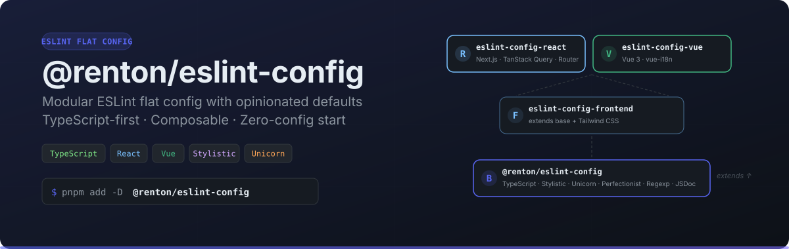

<p align="center">
  
</p>

<p align="center">
  <a href="https://www.npmjs.com/package/@renton/eslint-config"></a>
  <a href="https://www.npmjs.com/package/@renton/eslint-config"></a>
  <a href="./LICENSE"></a>
  
  
</p>

---

## Features

- **Flat config native** — built for ESLint's flat config system, no legacy `.eslintrc`
- **TypeScript-first** — full type-aware linting out of the box
- **Modular monorepo** — pick only what you need: base, frontend, React, or Vue
- **Opinionated defaults** — 15+ carefully configured plugins, zero boilerplate
- **Composable** — extend with custom rules, or stack packages for complex setups

## Requirements

- **Node.js** >= 24.0.0 (development requires >= 26.0.0)
- **ESLint** >= 9.0.0
- **pnpm** >= 10.0.0 (for development)

## Packages

| Package | Description |
|---------|-------------|
| [`@renton/eslint-config`](./packages/base) | Core config — TypeScript, Stylistic, Unicorn, Perfectionist, Regexp, JSDoc, and more |
| [`@renton/eslint-config-frontend`](./packages/frontend) | Frontend config — extends base with Tailwind CSS support |
| [`@renton/eslint-config-react`](./packages/react) | React config — extends frontend with React, Next.js, TanStack Query/Router |
| [`@renton/eslint-config-vue`](./packages/vue) | Vue config — extends frontend with Vue 3, vue-i18n support |

## Quick Start

### Base (Node.js / Generic TypeScript)

```bash
pnpm add -D @renton/eslint-config eslint
```

```ts
// eslint.config.ts
import { renton } from "@renton/eslint-config";

export default renton();
```

### React (Next.js / TanStack)

```bash
pnpm add -D @renton/eslint-config-react eslint
```

```ts
// eslint.config.ts
import { rentonReact } from "@renton/eslint-config-react";

export default rentonReact({
  next: true,
  tanstackQuery: true,
});
```

### Vue

```bash
pnpm add -D @renton/eslint-config-vue eslint
```

```ts
// eslint.config.ts
import { rentonVue } from "@renton/eslint-config-vue";

export default rentonVue();
```

## Options

All framework functions accept an options object. These are the available toggles (all default to `true` unless noted):

| Option | Type | Default | Description |
|--------|------|---------|-------------|
| `typescript` | `boolean` | `true` | TypeScript rules via `typescript-eslint` |
| `stylistic` | `boolean \| StylisticOptions` | `true` | Code style rules via `@stylistic/eslint-plugin` |
| `unicorn` | `boolean` | `true` | Best practice rules via `eslint-plugin-unicorn` |
| `perfectionist` | `boolean` | `true` | Import/export sorting via `eslint-plugin-perfectionist` |
| `regexp` | `boolean` | `true` | RegExp best practices via `eslint-plugin-regexp` |
| `jsdoc` | `boolean` | `true` | JSDoc rules via `eslint-plugin-jsdoc` |
| `node` | `boolean` | `true` | Node.js rules via `eslint-plugin-n` |
| `jsonc` | `boolean` | `true` | JSON(C) linting via `eslint-plugin-jsonc` |
| `yaml` | `boolean` | `true` | YAML linting via `eslint-plugin-yml` |
| `markdown` | `boolean` | `true` | Markdown code block linting via `@eslint/markdown` |
| `gitignore` | `boolean` | `true` | Auto-ignore files from `.gitignore` |
| `typeAware` | `boolean` | `false` | Enable type-aware TypeScript rules (slower) |

### Stylistic Options

When `stylistic` is an object, you can customize:

| Option | Type | Default | Description |
|--------|------|---------|-------------|
| `quotes` | `"double" \| "single"` | `"double"` | Quote style |
| `semi` | `boolean` | `true` | Semicolons |
| `indent` | `number \| "tab"` | `2` | Indentation |
| `braceStyle` | `"1tbs" \| "stroustrup" \| "allman"` | `"1tbs"` | Brace style |

### React Options

| Option | Type | Default | Description |
|--------|------|---------|-------------|
| `next` | `boolean` | `false` | Enable Next.js rules |
| `tanstackQuery` | `boolean` | `false` | Enable TanStack Query rules |
| `tanstackRouter` | `boolean` | `false` | Enable TanStack Router rules |
| `tailwindcss` | `boolean` | `false` | Enable Tailwind CSS (requires `tailwindcssConfigPath`) |

### Vue Options

| Option | Type | Default | Description |
|--------|------|---------|-------------|
| `vue` | `boolean` | `true` | Enable Vue 3 rules |
| `vueI18n` | `boolean` | `false` | Enable vue-i18n rules (requires `vueI18nLocaleDir`) |
| `tailwindcss` | `boolean` | `false` | Enable Tailwind CSS (requires `tailwindcssConfigPath`) |

## Customization

Override any rule by passing additional configs:

```ts
import { renton } from "@renton/eslint-config";

export default renton(
  {
    // options
  },
  {
    // custom rules — appended after all presets
    rules: {
      "no-console": "warn",
      "ts/no-explicit-any": "off",
    },
  },
);
```

## Development

```bash
# Install dependencies
pnpm install

# Build all packages
pnpm build

# Lint the monorepo
pnpm lint

# Run tests
pnpm test
```

## License

[MIT](./LICENSE)
