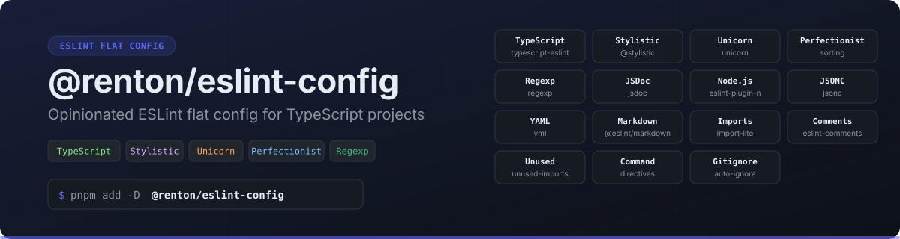

<p align="center">
  
</p>

Opinionated ESLint flat config for TypeScript projects. Part of the [`@renton/eslint-config`](../../) monorepo.

## Install

```bash
pnpm add -D @renton/eslint-config eslint
```

## Usage

```ts
// eslint.config.ts
import { renton } from "@renton/eslint-config";

export default renton();
```

## Included Plugins

| Plugin | Description |
|--------|-------------|
| `typescript-eslint` | TypeScript rules |
| `@stylistic/eslint-plugin` | Code style (quotes, semicolons, indentation) |
| `eslint-plugin-unicorn` | Best practices and modern patterns |
| `eslint-plugin-perfectionist` | Import/export sorting |
| `eslint-plugin-regexp` | RegExp best practices |
| `eslint-plugin-jsdoc` | JSDoc conventions |
| `eslint-plugin-n` | Node.js rules |
| `eslint-plugin-jsonc` | JSON(C) linting |
| `eslint-plugin-yml` | YAML linting |
| `@eslint/markdown` | Markdown code block linting |
| `eslint-plugin-import-lite` | Import resolution |
| `eslint-plugin-unused-imports` | Remove unused imports |
| `@eslint-community/eslint-plugin-eslint-comments` | ESLint directive comments |
| `eslint-plugin-command` | Custom directives |

## Options

```ts
export default renton({
  typescript: true,      // TypeScript rules
  stylistic: true,       // Code style (or object for custom options)
  unicorn: true,         // Best practices
  perfectionist: true,   // Import sorting
  regexp: true,          // RegExp rules
  jsdoc: true,           // JSDoc rules
  node: true,            // Node.js rules
  jsonc: true,           // JSON linting
  yaml: true,            // YAML linting
  markdown: true,        // Markdown linting
  gitignore: true,       // Auto-ignore .gitignore entries
  typeAware: false,      // Type-aware TypeScript rules (slower)
});
```

### Stylistic Options

```ts
export default renton({
  stylistic: {
    quotes: "double",       // "double" | "single"
    semi: true,             // boolean
    indent: 2,              // number | "tab"
    braceStyle: "1tbs",     // "1tbs" | "stroustrup" | "allman"
  },
});
```

## Custom Rules

```ts
export default renton(
  {},
  {
    rules: {
      "no-console": "warn",
      "ts/no-explicit-any": "off",
    },
  },
);
```

## License

[Apache-2.0](../../LICENSE)
