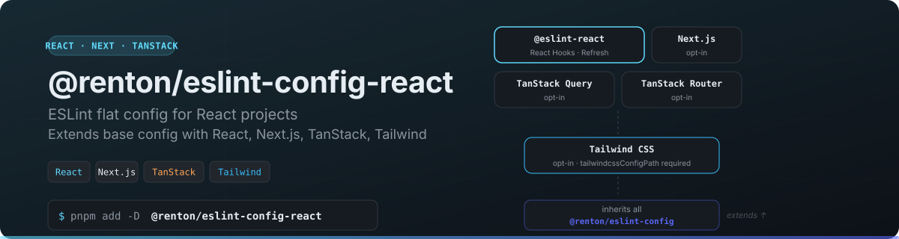

<p align="center">
  
</p>

Opinionated ESLint flat config for React projects (Next.js, TanStack). Extends [`@renton/eslint-config`](../base) with React-specific rules. Part of the [`@renton/eslint-config`](../../) monorepo.

## Install

```bash
pnpm add -D @renton/eslint-config-react eslint
```

## Usage

```ts
// eslint.config.ts
import { rentonReact } from "@renton/eslint-config-react";

export default rentonReact();
```

### With Options

```ts
export default rentonReact({
  next: true,            // Next.js rules
  tanstackQuery: true,   // TanStack Query rules
  tanstackRouter: true,  // TanStack Router rules
  tailwindcss: true,     // Tailwind CSS (requires tailwindcssConfigPath)
  tailwindcssConfigPath: "./tailwind.config.ts",
});
```

## Included Plugins

Extends all [base plugins](../base#included-plugins) plus:

| Plugin | Description |
|--------|-------------|
| `@eslint-react/eslint-plugin` | React best practices |
| `eslint-plugin-react-hooks` | React Hooks rules |
| `eslint-plugin-react-refresh` | Fast Refresh validation |
| `@next/eslint-plugin-next` | Next.js rules (opt-in) |
| `@tanstack/eslint-plugin-query` | TanStack Query rules (opt-in) |
| `@tanstack/eslint-plugin-router` | TanStack Router rules (opt-in) |
| `eslint-plugin-tailwindcss` | Tailwind CSS rules (opt-in) |

## Options

| Option | Type | Default | Description |
|--------|------|---------|-------------|
| `next` | `boolean` | `false` | Enable Next.js rules |
| `tanstackQuery` | `boolean` | `false` | Enable TanStack Query rules |
| `tanstackRouter` | `boolean` | `false` | Enable TanStack Router rules |
| `tailwindcss` | `boolean` | `false` | Enable Tailwind CSS |
| `tailwindcssConfigPath` | `string` | - | Path to Tailwind config (required if `tailwindcss: true`) |

All [base options](../base#options) are also supported.

## Custom Rules

```ts
export default rentonReact(
  { next: true },
  {
    rules: {
      "react/no-array-index-key": "warn",
    },
  },
);
```

## License

[Apache-2.0](../../LICENSE)
