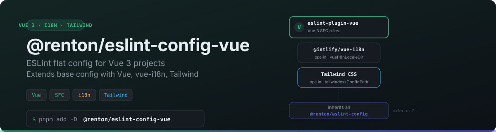

<p align="center">
  
</p>

Opinionated ESLint flat config for Vue 3 projects. Extends [`@renton/eslint-config`](../base) with Vue-specific rules. Part of the [`@renton/eslint-config`](../../) monorepo.

## Install

```bash
pnpm add -D @renton/eslint-config-vue eslint
```

## Usage

```ts
// eslint.config.ts
import { rentonVue } from "@renton/eslint-config-vue";

export default rentonVue();
```

### With Options

```ts
export default rentonVue({
  vue: true,                    // Vue 3 rules (default: true)
  vueI18n: true,                // vue-i18n rules
  vueI18nLocaleDir: "./src/locales", // Locale directory (required if vueI18n: true)
  tailwindcss: true,            // Tailwind CSS
  tailwindcssConfigPath: "./tailwind.config.ts",
});
```

## Included Plugins

Extends all [base plugins](../base#included-plugins) plus:

| Plugin | Description |
|--------|-------------|
| `eslint-plugin-vue` | Vue 3 rules |
| `vue-eslint-parser` | Vue SFC parser |
| `@intlify/eslint-plugin-vue-i18n` | vue-i18n rules (opt-in) |
| `eslint-plugin-tailwindcss` | Tailwind CSS rules (opt-in) |

## Options

| Option | Type | Default | Description |
|--------|------|---------|-------------|
| `vue` | `boolean` | `true` | Enable Vue 3 rules |
| `vueI18n` | `boolean` | `false` | Enable vue-i18n rules |
| `vueI18nLocaleDir` | `string` | - | Path to locale files (required if `vueI18n: true`) |
| `tailwindcss` | `boolean` | `false` | Enable Tailwind CSS |
| `tailwindcssConfigPath` | `string` | - | Path to Tailwind config (required if `tailwindcss: true`) |

All [base options](../base#options) are also supported.

## Custom Rules

```ts
export default rentonVue(
  {},
  {
    rules: {
      "vue/no-v-html": "warn",
    },
  },
);
```

## License

[Apache-2.0](../../LICENSE)
